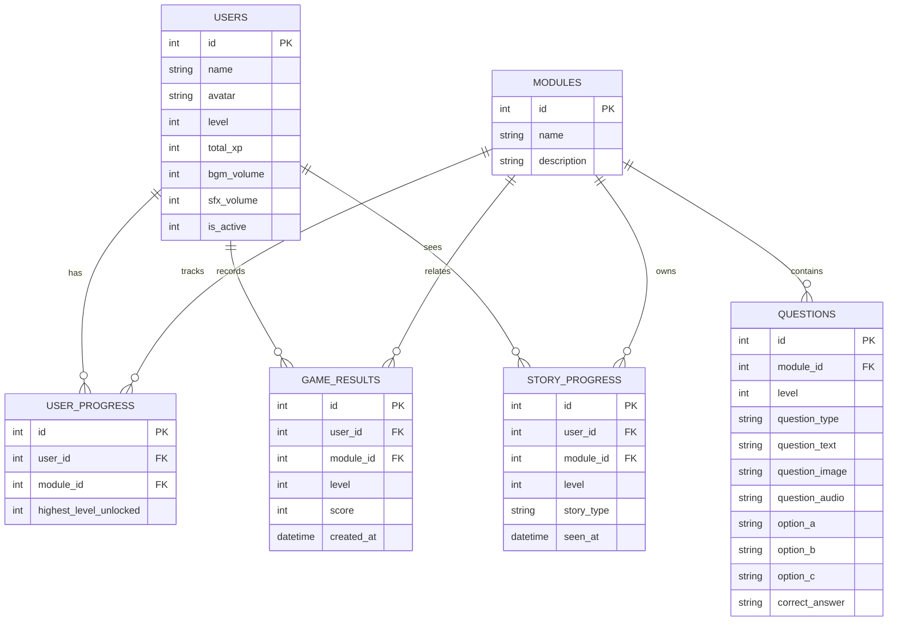

# 🎮 Petualangan Belajar

## Media Pembelajaran Digital Interaktif Berbasis Desktop  
### untuk Pendidikan Anak Usia Dini

---

## 📌 Deskripsi Umum

**Petualangan Belajar** merupakan aplikasi media pembelajaran digital interaktif berbasis desktop yang dikembangkan menggunakan **bahasa pemrograman Java** dan **Java Swing**.  
Aplikasi ini dirancang untuk membantu proses **pengenalan konsep dasar anak usia dini** melalui pendekatan **pembelajaran berbasis permainan (game-based learning)**.

Aplikasi menyajikan materi pembelajaran dalam bentuk permainan edukatif yang interaktif, dilengkapi dengan sistem **umpan balik**, **skor**, **EXP**, **level**, dan **leaderboard** untuk meningkatkan motivasi belajar anak.  
Seluruh progres pembelajaran pengguna disimpan secara lokal menggunakan **basis data SQLite**.

Repositori ini berisi **source code lengkap** aplikasi yang digunakan sebagai bagian dari laporan akademik.

---

## 🎯 Tujuan Pengembangan

Tujuan pengembangan aplikasi ini adalah:
- Menyediakan media pembelajaran digital yang interaktif dan menarik bagi anak usia dini
- Membantu anak mengenal konsep dasar seperti angka, huruf, warna, dan bentuk
- Mengimplementasikan unsur permainan untuk meningkatkan minat dan motivasi belajar
- Menyediakan sistem pencatatan progres belajar secara otomatis dan berkelanjutan

---

## 🧩 Fitur Utama Aplikasi

- Splash Screen dan Title Screen
- Menu Utama Aplikasi
- Manajemen Profil Pengguna
- Pemilihan Modul Pembelajaran
- Pemilihan Level (berdasarkan progres)
- Gameplay interaktif berbasis soal
- Beragam tipe soal:
  - Pilihan ganda
  - Klik objek
  - Input sederhana
  - Urutan (sequence)
  - Perbandingan visual
- Sistem skor, EXP, dan level
- Sistem reward dan feedback visual/audio
- Leaderboard (peringkat pengguna)
- Pengaturan suara (background music dan sound effect)
- Penyimpanan progres menggunakan database SQLite

---

## 📚 Modul Pembelajaran

Aplikasi terdiri dari beberapa modul pembelajaran, antara lain:

1. **Modul Angka**  
   Pengenalan angka, pengurutan, dan perhitungan sederhana

2. **Modul Huruf**  
   Pengenalan huruf dan pola dasar

3. **Modul Warna**  
   Pengenalan warna melalui objek visual

4. **Modul Bentuk**  
   Pengenalan bentuk dasar melalui interaksi visual

Setiap modul terdiri dari beberapa level dengan tingkat kesulitan bertahap.

---

## 🛠 Teknologi yang Digunakan

- **Bahasa Pemrograman** : Java  
- **Framework GUI** : Java Swing  
- **Database** : SQLite  
- **IDE** : Apache NetBeans IDE  
- **Pengolahan Audio** : Audacity  
- **Pengolahan Aset Visual** : PhotoRoom  
- **Packaging Installer** : WiX Toolset  

---

## 🗂 Struktur Folder Proyek

Berikut adalah struktur folder utama pada proyek **Petualangan Belajar**:

```text

PetualanganBelajar/
│
├── audio/
│   └── File audio (BGM & sound effect)
│
├── src/
│   └── com/
│       └── petualanganbelajar/
│
│           ├── Main.java
│
│           ├── content/
│           │   ├── ColorContent.java
│           │   ├── LetterContent.java
│           │   ├── MathContent.java
│           │   ├── ShapeContent.java
│           │   ├── GeneratorUtils.java
│           │   └── StoryDataManager.java
│
│           ├── core/
│           │   ├── GameConfig.java
│           │   ├── GameInputManager.java
│           │   ├── GameSession.java
│           │   ├── GameState.java
│           │   ├── ScreenManager.java
│           │   ├── SoundPlayer.java
│           │   └── StoryController.java
│
│           ├── db/
│           │   ├── DatabaseConnection.java
│           │   └── DatabaseInitializer.java
│
│           ├── model/
│           │   ├── UserModel.java
│           │   ├── ModuleModel.java
│           │   ├── QuestionModel.java
│           │   ├── QuestionType.java
│           │   └── LeaderboardEntry.java
│
│           ├── repository/
│           │   ├── UserRepository.java
│           │   ├── ModuleRepository.java
│           │   ├── QuestionRepository.java
│           │   ├── ProgressRepository.java
│           │   ├── StoryRepository.java
│           │   └── LeaderboardRepository.java
│
│           ├── ui/
│           │   ├── component/
│           │   │   ├── Custom buttons, dialogs, HUD, UI components
│           │   │   └── (AbstractGameButton, LevelUpDialog, dsb.)
│           │   │
│           │   └── screen/
│           │       ├── SplashScreen.java
│           │       ├── TitleScreen.java
│           │       ├── MainMenuScreen.java
│           │       ├── ProfileSelectionScreen.java
│           │       ├── ProfileCreateScreen.java
│           │       ├── ModuleSelectionScreen.java
│           │       ├── GameScreen.java
│           │       ├── ResultScreen.java
│           │       ├── LeaderboardScreen.java
│           │       └── SettingsScreen.java
│
│           ├── util/
│           │   ├── UIHelper.java
│           │   ├── GameVisualizer.java
│           │   ├── LevelManager.java
│           │   ├── GameThemeManager.java
│           │   ├── ModuleTheme.java
│           │   └── StyleConstants.java
│
├── images/
│   └── Asset gambar UI
│
├── images_char/
│   └── Asset karakter
│
├── Libraries/
│   └── Library eksternal (SQLite JDBC, dsb.)
│
└── README.md

```

## 🗄 Basis Data

Aplikasi menggunakan **SQLite** sebagai basis data lokal.  
Database dibuat secara otomatis saat aplikasi dijalankan pertama kali dan digunakan untuk menyimpan:

- Data pengguna
- Progres pembelajaran
- Skor dan EXP
- Level pengguna
- Riwayat hasil permainan
- Status cerita (intro/epilog)




### 🗄 Penjelasan Entity Relationship Diagram (ERD)

- **users**  
  Menyimpan data pengguna aplikasi, termasuk nama, avatar, level, total EXP, serta pengaturan suara.

- **modules**  
  Menyimpan informasi modul pembelajaran yang tersedia dalam aplikasi.

- **questions**  
  Menyimpan soal-soal pembelajaran yang dikelompokkan berdasarkan modul dan level.

- **user_progress**  
  Menyimpan progres pengguna pada setiap modul, khususnya level tertinggi yang telah terbuka.

- **game_results**  
  Menyimpan hasil permainan pengguna berupa skor per modul dan level.  
  Tabel ini menggunakan *unique constraint* `(user_id, module_id, level)` untuk mencegah duplikasi data.

- **story_progress**  
  Menyimpan status cerita (intro/epilog) yang telah ditampilkan kepada pengguna agar tidak ditampilkan berulang.

---

## ▶️ Cara Menjalankan Aplikasi

1. Clone repositori:
   ```bash
   git clone https://github.com/dygnora/PetualanganBelajar.git
2. Buka proyek menggunakan Apache NetBeans IDE

3. Pastikan library SQLite JDBC tersedia

4. Jalankan file:
   Main.java
